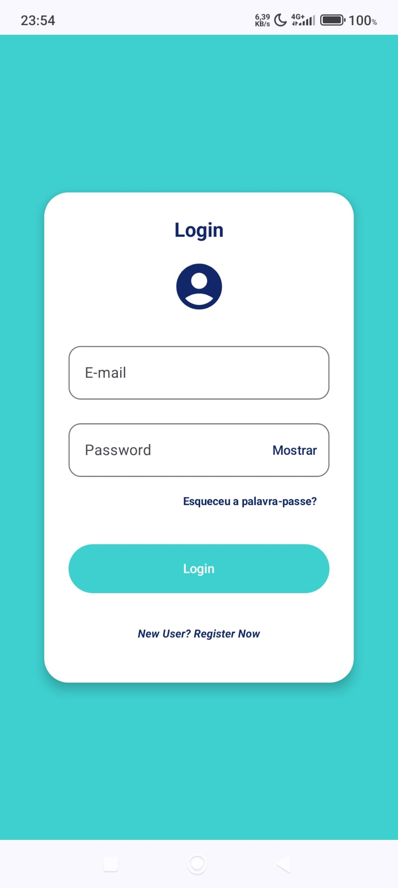
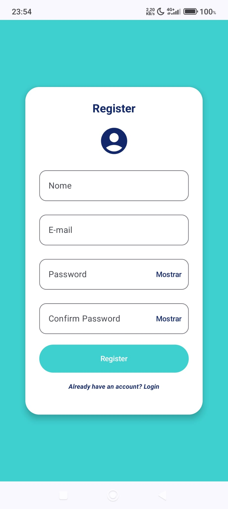
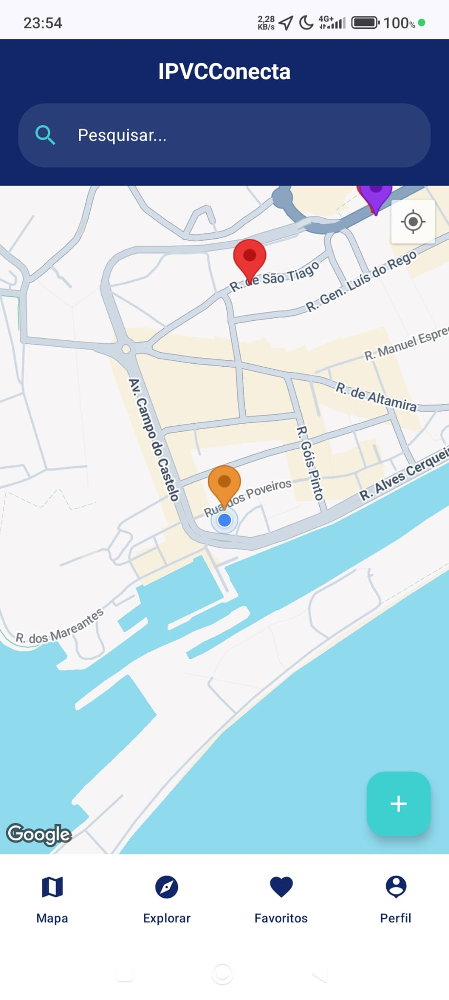
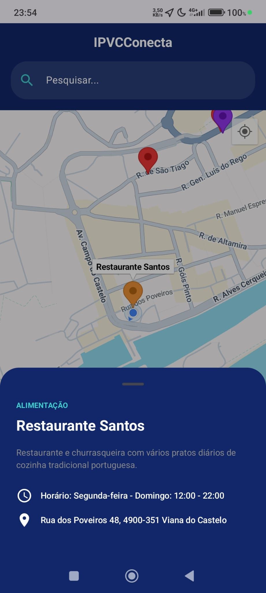
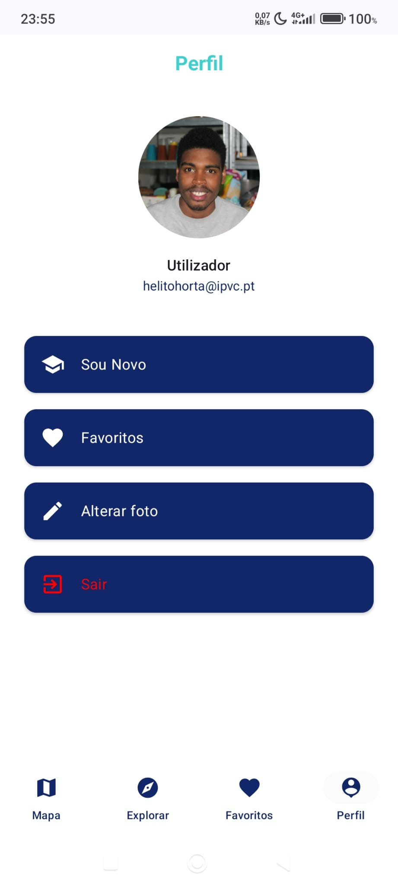
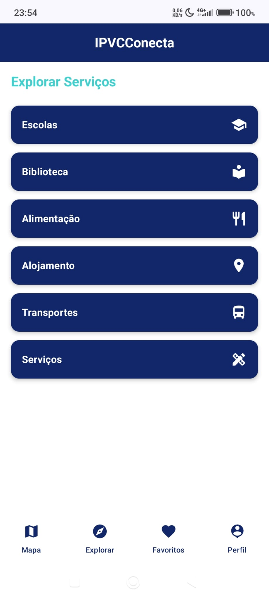
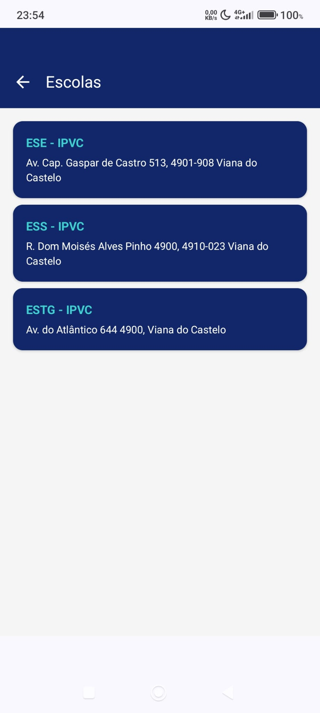

# 📍 IPVCConecta

**IPVCConecta** é uma aplicação nativa Android desenvolvida para auxiliar a integração e mobilidade de novos alunos no Instituto Politécnico de Viana do Castelo. A app funciona como um guia de bolso interativo, permitindo localizar escolas, serviços e pontos de interesse.

---

## ✨ Funcionalidades Principais

* 🗺️ **Mapa Interativo:** Visualização de pontos de interesse no Google Maps.
* 💾 **Offline-First:** A app guarda os dados localmente (Room Database), permitindo consultar o mapa e favoritos mesmo **sem internet**.
* 🔍 **Pesquisa e Filtros:** Encontra locais por nome ou categoria (Escolas, Alimentação, Transportes).
* 👤 **Perfil de Utilizador:** Login, Registo e Upload de Foto de Perfil.
* ⭐ **Favoritos:** Guarda os teus locais preferidos para acesso rápido.

---

## 📱 Capturas de Ecrã

| Login | Registo |
|:---:|:---:|
|  |  | |
| **Autenticação Segura** | **Google Maps Integrado** |

| Detalhes do Local | Perfil de Utilizador |
|:---:|:---:|
|  ||

| Explorar Categorias |
|:---:|
|  ||

---

## 🛠️ Tecnologias Utilizadas

* **Linguagem:** Kotlin
* **UI:** Jetpack Compose (Material Design 3)
* **Arquitetura:** MVVM (Model-View-ViewModel)
* **Base de Dados Local:** Room Database
* **Cloud & Backend:** Firebase (Firestore, Auth, Storage)
* **Mapas:** Google Maps SDK
* **Imagens:** Coil (Async Image Loading)
* **Navegação:** Navigation Compose

---

## ⚙️ Configuração do Projeto

> ⚠️ **Nota Importante:** Este projeto utiliza o Google Maps SDK. Por questões de segurança, a Chave de API não está incluída no repositório.

Para executar o projeto:
1.  Clone este repositório.
2.  Crie um ficheiro `apikey.properties` na raiz do projeto.
3.  Adicione a sua chave: `MAPS_API_KEY=AIzaSyA...`
4.  Compile no Android Studio.

---

### 👨‍💻 Autor

Desenvolvido por **Hélito Mendes** (Nº 32440)
Licenciatura em Engenharia de Redes e Sistemas de Computadores - IPVC.

